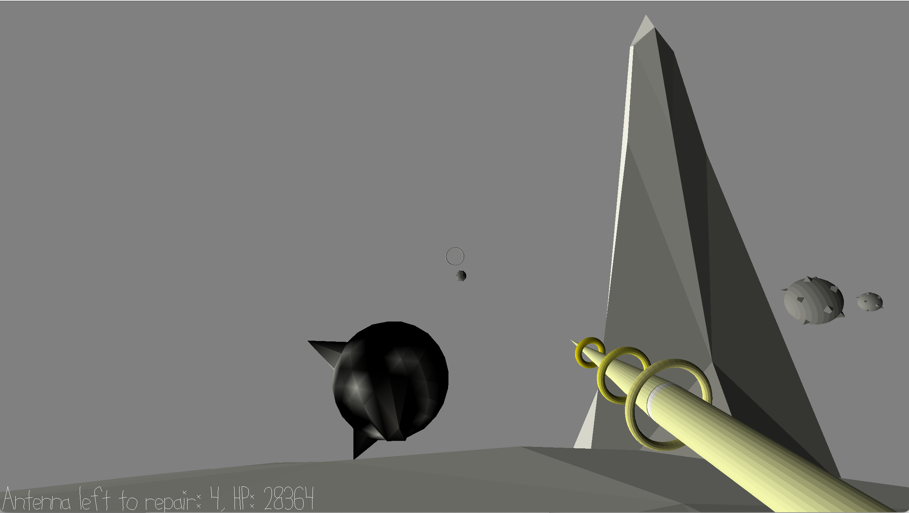

# (TODO: your game's title)

Author: (TODO: your name)

Design: (TODO: In two sentences or fewer, describe what is new and interesting about your game.)

Screen Shot:

How To Play:

(TODO: describe the controls and (if needed) goals/strategy.)

Sources: (TODO: list a source URL for any assets you did not create yourself. Make sure you have a license for the asset.)

Attributions:
This game reuses some codes and blender assets of game3. All the codes copied from game3 are in the commit with tag `game3`.

This game was built with [NEST](NEST.md).

